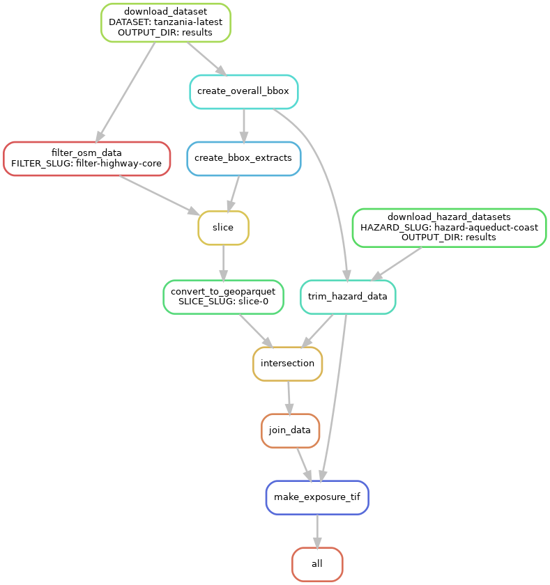

# Open Global Infrastructure Risk/Resilience Analysis

[](https://nismod.github.io/open-gira)
[](https://github.com/nismod/open-gira/actions/workflows/test.yml)

This open-source [snakemake](https://snakemake.readthedocs.io/en/stable/) workflow will 
analyse physical climate risks to infrastructure networks using global open data. 

The related open-source Python library [snail](https://github.com/nismod/snail) provides
some of the core functionality.

> Work in Progress
>
> Goals: 
> - automated pipeline for reproducible analysis anywhere in the world
> - maps per-country and of larger areas
> - charts/stats of exposure per admin region, per hazard type, scenario, epoch
> - consider transport, electricity, water, communications systems
> - consider river flooding, storm surge coastal flooding, tropical cyclones
> - estimate direct damages to physical networks
> - estimate indirect effects of disruption - people affected, economic activity disrupted
>
> Non-goals:
> - will not build on closed data sources, which may be appropriate for other projects or use-cases
> - long-term planning or detailed operational simulation

## Installation

### conda

This repository comes with a `environment.yml` file describing the conda and pip packages required to run `open-gira`.

Create the `open-gira` conda environment:
```
conda env create -f workflow/envs/environment.yml
```
and activate it
```
conda activate open-gira
```

### pip

Install python requirements as listed in `requirements.txt` - for
example using a venv:

```
python3 -m venv ./venv
. venv/bin/activate
pip install -r requirements.txt
```

### Install osmium-tool

Install [`osmium-tool`](https://osmcode.org/osmium-tool/manual.html) according to the
instructions there. Tests run with versions:
- osmium-tool v1.13.2
- libosmium v2.17.1


## Running tests

Workflow steps are tested using a small sample dataset. Run:

```
python -m pytest tests
```

## Downloading datasets

The workflow downloads OpenStreetMap datasets and hazard raster files and combines them.
The locations of the datasets to download are specified in `config/config.yaml`.

## Running the pipeline

The snakemake configuration details are in `config/config.yml`. 
You can edit this to set the target OSM
infrastructure datasets, number of slices, and hazard datasets. See
[config/README.md](https://github.com/nismod/open-gira/blob/main/config/README.md)
for details on the configuration variables.
For new users, the default values should suffice.

You can then run the exposure analysis pipeline automatically using
snakemake, like so

```
snakemake --cores 8
```

Individual configuration parameters can be overridden from the command
line, for instance

```
snakemake --cores 1 --config output_dir=output slice_count=8
```

It may be useful to maintain several configuration files. You can
specify a configuration to be used in place of the default
`config/config.yml` like so

```
snakemake --cores 8 --configfile config/my_other_config.yml
```

Note that pathways in the config file are always relative to the open-gira
project root, not the location of the config file.

## Step-by-step description of the pipeline

The pipeline starts from a OpenStreetMap dataset (_e.g._
`europe-latest`) and produces network/flood hazard intersection data,
associating road splits to corresponding flood levels.

The pipeline consists in the following steps:

1. The target OSM datasets are downloaded or copied and saved as 
   `<output_dir>/input/<dataset>.osm.pbf`.
2. The initial OSM datasets are filtered, keeping only relevant tags for road links
   (using `osmium tags-filter`). This results in smaller files
   `<output_dir>/input/<dataset>_filter-<filters>.osm.pbf`, where `<dataset>` is the
   key name and `<filters>` is the filename of the `osmium_tags_filter` file in the config.
3. The OSM dataset's headers are examined for a `bbox` property and that is used
   to determine the bounding box for the whole area (`<output_dir>/json/<dataset>.json`).
4. The hazard raster files for each hazard datasets are located by reading a list
   of their locations from the config. Each of these locations is visited and the
   .tif file downloaded or copied to `<output_dir>/input/hazard-<hazard>/raw/<filename>`
   where `<hazard>` is the keyname in the config and `<filename>` is the file's
   base name.
5. Each hazard raster file is clipped to contain just the hazard data for each dataset.
   These files are stored in `<output_dir>/input/hazard-<hazard>/<dataset>/<filename>`
   where `<dataset>` is the OSM dataset whose bounding box is used for clipping.
6. The OSM dataset bounding box is sliced into a grid of smaller bounding boxes
   according to the `slice_count` config option, and these slices are saved
   in a json file `<output_dir>/json/<dataset>-extracts.geojson`.
7. The filtered OSM file is sliced into areas of equal size using the bounding 
   box grid from step 6. The slices are saved to 
   `<output_dir>/slices/<dataset>_filter-<filter>/slice-<N>.osm.pbf`.
8. Each filtered OSM dataset slice is then converted to the GeoParquet data format,
   resulting in `<output_dir>/geoparquet/<dataset>_filter-<filters>_slice-<N>.geoparquet`.
9. Each geoparquet slice is intersected against flood level data from the
   hazard datasets. The hazard datasets consist of a collection of
   raster data files. The network/hazard intersection results in data
   `<output_dir>/splits/<dataset>_filter-<filters>_slice-<N>_hazard-<hazard>.geoparquet` 
   describing roads split according to the raster grid and associated flood level values.
   A corresponding `parquet` files (without geometries) is also created.
10. Split data is then joined into a unique dataset describing 
    infrastructure and associated hazard level values for each combination of
    OSM dataset and hazard dataset. This results in
    `<output_dir>/<dataset>_filter-<filters>_hazard-<hazard>.geoparquet`.
11. Each .geoparquet file is processed to produce a .tif raster file showing the length
    of road affected by flooding greater than a threshold defined in the config.
    These files are saved as `<output_dir>/exposure/<dataset>_filter-<filters>/hazard-<hazard>/exposure_<hazard_tif_filename>`

This is a directional acyclic graph (DAG) of a simplified version of the workflow
that uses just one OSM dataset, one hazard dataset, and one slice:


### Keeping things tidy

You can remove all intermediate files by running

```
snakemake -c1 clean
```

Note that this will *not* remove the final data files
`<output_dir>/<dataset>_filter-<filters>_hazard-<hazard>.geoparquet`,
nor will it remove the original input files `<output_dir>/input/*`.

You can remove all intermediate data _including_ input files by running
```
snakemake -c1 clean_all
```

Snakemake has utilities to improve the workflow code quality:
- `snakemake --lint` suggests improvements and fixes for common problems
- `snakefmt .` reformats files according to a code style guide, similar to `black` for Python code.

