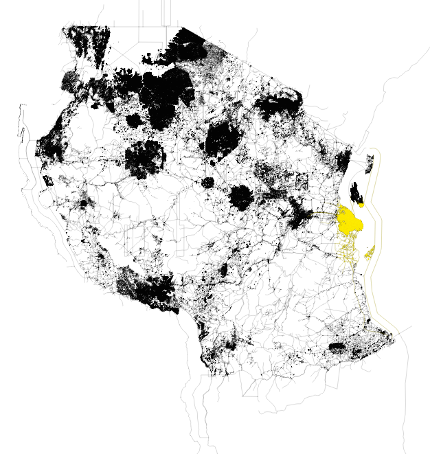
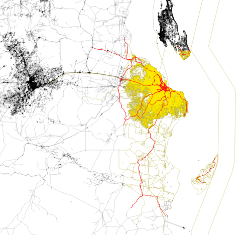
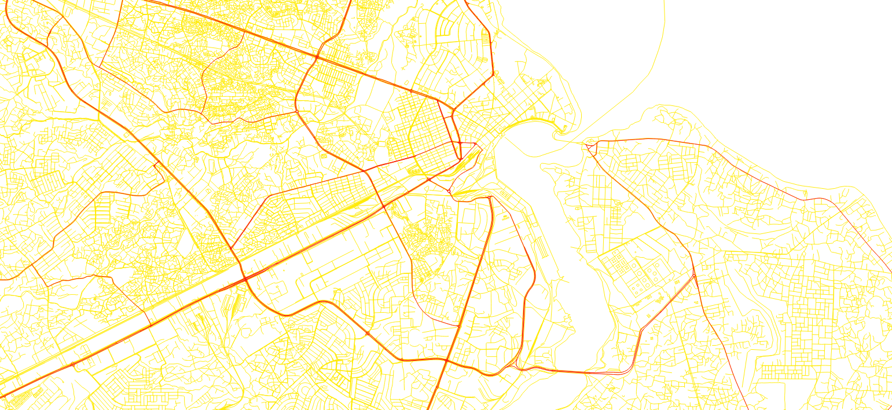
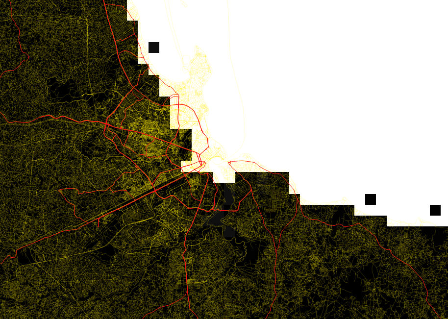

# open-gira new user guide

This guide is intended to allow new users to learn to use open-gira as rapidly as possible. 

## Contents:
- [Introduction](#Introduction)
- [Downloading prerequisites](#Downloading-prerequisites)
- [Running open-gira](#[Running-open-gira)
- [Exploring output](#Exploring-output)
- [Further analysis](#Further-analysis)

## Introduction

open-gira is designed to combine infrastructure information with hazard information to
produce an estimate of the threat those hazards represent to that infrastructure.
In this new user guide we will be using a map of roads in Tanzania, and exploring their
vulnerability to flooding (from both coasts and rivers).

## Downloading prerequisites

There are four things you need to have in order to run through this guide: 
* open-gira
* QGIS
* Tanzania OpenStreetMap data
* Tanzania flood hazard data

We will go through installing them all in order.

### open-gira 

The instructions for installing open-gira are available in the 
[readme for the repository](https://github.com/nismod/open-gira) on GitHub.
If you are trying to install on **Windows**, use Windows Subsystems for Linux (WSL).
Linux users may find the version of osmium-tool provided by their package repository
is out of date.
The instructions for building osmium-tool from source on Linux should work, however.

Once it's installed, run the tests to ensure everything is linked up properly:

```
python -m pytest tests
```

### QGIS

[QGIS](https://qgis.org/) is a program for viewing and creating geographic data files.
The program is well-maintained and available for Windows, Mac, and Linux.
Installing the program and all its components may take several hours.
[TODO: Provide a list of required components to shorten install time?]

### Tanzania OpenStreetMap data

Now we have the programs we need, we can download the data we'll be using.
The infrastructure data will be obtained from the OpenStreetMap file for Tanzania.
To download, click [this direct link](https://download.geofabrik.de/africa/tanzania-latest.osm.pbf)
or choose 'tanzania-latest.osm.pbf' from the 
[OpenStreetMap website](https://download.geofabrik.de/africa/tanzania.html).

The tanzania-latest.osm.pbf file should be stored inside your open-gira directory as
`./data/tanzania-latest.osm.pbf`. You may have to create the `./data` directory yourself.
Once you've downloaded and saved the file, open it in QGIS to take a look at its structure. 
You'll see it contains several layers of information. 
There's an awful lot of information here, so you may find that any adjustment in the view 
results in a very long rendering time.
QGIS experts can shorten this by playing with filters, etc., but new users
may find it easier to wait it out and scan ahead in this guide while waiting.
The one we are most interested in is the _lines_ layer, which shows the roads.
If you open up the lines layer, you'll see a skeleton of Tanzania showing the road infrastructure.


### Tanzania flood hazard data

The last thing we need before we can get going is some data on the hazards that threaten the infrastructure.
The hazard information is presented as a series of image files.
Each image file shows the expected flood coverage within a given return 
period.^[This means the most dramatic flooding we would expect within a given window of time, e.g. 10 years or 100 years.]
The images are also split by whether they include subsidence in the modelling, the climate model they use,
and when their data or predictions come from.

Although the .tif files are image files, they do not have normal image information (so they will look completely black
if opened in an image editor). 
Instead of several colour/alpha channels of data, these files just have a single channel of data with (usually) very
low values (specifying water height at each pixel).
To see the flood information in an image, open it in QGIS.
In the screenshot below, we chose the last file in the `./data/aqueduct/` directory,
`./data/aqueduct/inunriver_rcp8p5_MIROC-ESM-CHEM_2080_rp01000.tif`.
Alongside the image (.tif) files, there are two .csv files that include metadata for the hazard data.
These .csv files (one for coastal and one for river flood hazards) describe what each image file represents.


You can acquire the .zip file with the images and metadata from 
[the Zenodo repository](https://zenodo.org/record/5887564).
All these files should be unpacked and placed in the `./data/aqueduct` directory, so that the path to 
aqueduct_river.csv is `./data/aqueduct/aqueduct_river.csv`, and all the .csv and .tif files are in the same directory.

## Running open-gira

Now we have the infrastructure and hazard data we can use open-gira to combine them.
This is done using [snakemake](https://snakemake.readthedocs.io/en/stable/), a workflow management tool that
will organise performing a series of operations on the data.
Those operations will be: 
* chopping the data up into slices to improve efficiency
* using `osmium` to identify the highways
* combining the infrastructure and hazard data
* formatting output

From our perspective, we have three jobs to do: configuration, setup, and running.

### Configuration

The configuration file for the run is found in `./config/config.yaml`.
If everything has been set up according to this guide so far, this config file should not need changing.
If the infrastructure or hazard data are stored somewhere other than `./data` and `./data/aqueduct` then
the relevant paths should be specified in `data_dir` and `hazard_data_dir`.
The `output_dir` will be created when the workflow is run.
As with the other paths, this will be interpreted with respect to the open-gira directory, so the default
`results` will create `./results` to house the output.
Make sure dataset is `tanzania-latest`. 
Everything else should stay as it is.

### Setup

The final piece we need to have in place prior to running is a file that explains to open-gira how to slice up
the data files we gave it.
This file will be `./data/tanzania-latest-extracts.geojson` and we will generate it automatically by using
the `prepare-extracts.py` script.

First, however, we need to create a `./tanzania-latest.json` file that will be sliced into extracts by the script.
To do this, we create a new file, `./tanzania-latest.json` which looks like this:

```json5
{
    "directory": "./data",
    "extracts": [
        {
            "bbox": [
                29.24395,
              -11.775945,
              40.69487,
              -0.974988
            ],
            "output": "tanzania-latest.osm.pbf"
        }
	]
}
```

Those values in the `bbox` property are the start and end latitude and longitude of the area we want to slice up.
We can extract the values for the whole `tazania-latest.osm.pbf` file by looking in the header information of the file.
Run:

```shell
osmium fileinfo data/tazania-latest.osm.pbf
```

You should see an output that contains
```text
Header:
  Bounding boxes:
    (29.24395,-11.775945,40.69487,-0.974988)
```

Once we've created that `./tanzania-latest.json` file, we can create the extracts definition file automatically 
by running:

```
python prepare-extracts.py tanzania-latest.json 6
```

The script creates an n-by-n grid where n is the second command line argument, 6 in the example above.
Once the command is run we should see it has created a file `./data/tanzania-latest-extracts.geojson` with 36 (i.e. 6^2) 
slices defined in it (0 through 35).

### Running

With the requirements installed, data downloaded, configuration set, and the extracts file prepared, it's finally time
to run the program. 
When we run snakemake we have to tell it how many CPU cores it can use to do its processing.
If you have fewer than 4 cores, or wish to use more, substitute an appropriate number for the 4 below:

```shell
snakemake --cores 4
```

You should see a lot of text flashing by, and some loading bars.
Eventually, everything should finish with a report along the lines of:

```text
Finished job 0.
111 of 111 steps (100%) done
Complete log: /mnt/f/OxRSE/open-gira/.snakemake/log/2022-01-24T154611.005270.snakemake.log
```

## Exploring output

The program will have created a great many files in subdirectories of `./results`.
The main [README.md](https://github.com/nismod/open-gira) file describes the steps taken,
but we'll go over them again here and inspect the output of each.

### 1. Slice OSM dataset

The original dataset (`./data/tanzania-latest.osm.pbf`) is sliced into areas of equal size
according to the slices defined in (`./data/tanzania-latest-extracts.geojson`).
We'll find these in the `results/slices` directory.
As with the main .osm.pbf file, we can view this in QGIS. 

Open QGIS and load in the _lines_ for the original datafile, `./data/tanzania-latest.osm.pbf`.
When that's loaded, pull up one of the slices we created.
Several of the slices will not have road information, so we won't get any feedback in QGIS that
we've got any information in there at all. 
So we'll pick one that _does_ have information, slice 32 (Dar es Salaam):
`./results/slices/tanzania-latest-slice32.osm.pbf`.
Load up the _lines_ in that and you should see that it doubles up the road lines around Dar es Salaam
(Eastern coast of Tanzania).
In the image below, we have recoloured the lines so that the lines for slice 32 are in yellow.



### 2. Filter each slice by infrastructure

The original data contains lots and lots of information about points of interest, waterways, etc.
We strip them down to versions that contain only information about highways (and only highways that
match one of the types we specified in `./config/filters.txt`, or whichever other file we declared
as the `osmium_tags_filters_file` variable in `./config/config.yaml`).

These files are in `./results/filtered/`, so let's open one up in QGIS.
Load `./results/filtered/tanzania-latest-slice32.highway-core.osm.pbf`, 
and notice that there are fewer roads than in the previous file.
We've coloured the roads in the new file in red.



If you zoom in a lot, you'll see there are many, many roads that are not included in this smaller file.
Here, we've zoomed in on the port area of the city.



### 3. Convert Osmium files to GeoParquet format

Geoparquet files are files that contain geographic data alongside other information.
They are loaded into Python as dataframes (`geopandas.GeoDataFrame`).
The .geoparquet files are stored in `./results/geoparquet`.
Once again, let's open up the slice for Dar es Salaam, slice 32.
We'll do this using Python, so either write a script or pop open the console, and put in the following:

```python
import geopandas  # installed when we installed open-gira

# Assuming the open-gira root is the current working directory:
file_name = 'results/geoparquet/tanzania-latest-slice32.highway-core.geoparquet'

gp = geopandas.read_parquet(file_name)  # load the file

print(gp)  # Take a peek at the dataframe
```

We should get an output something like:

```text
                                              geometry     highway    id
0    LINESTRING (39.13700 -6.62114, 39.13776 -6.621...       trunk  None
1    LINESTRING (39.26407 -6.77160, 39.26266 -6.771...   secondary  None
2    LINESTRING (39.23765 -6.77090, 39.23705 -6.771...   secondary  None
3    LINESTRING (39.30578 -6.82119, 39.30526 -6.821...   secondary  None
4    LINESTRING (39.37496 -6.86819, 39.37437 -6.868...   secondary  None
..                                                 ...         ...   ...
865  LINESTRING (39.24408 -6.84490, 39.24324 -6.845...       trunk  None
866  LINESTRING (39.24554 -6.84430, 39.24436 -6.844...  trunk_link  None
867  LINESTRING (39.24168 -6.84576, 39.24211 -6.845...  trunk_link  None
868  LINESTRING (39.24986 -6.84211, 39.24903 -6.842...  trunk_link  None
869  LINESTRING (39.24591 -6.84376, 39.24603 -6.843...  trunk_link  None

[870 rows x 3 columns]
```

That looks about right -- we can see we have some geometry information, the type of the highway the geometry
describes, and an (unused) id field.

### 4. Intersect infrastructure and flood level

The intersection process inspects the geographic data for each of the rows in our .geoparquet files in 
`./results/geoparquet/` and produces a new file with the flood depths affecting that road in each
of the flood scenarios in `./data/aqueduct/`.
These new files are saved in `./results/splits/`. 
Let's use the Python console or update our Python script to load in the intersection information for
slice 32:

```python
# We already imported geopandas
slice_file_name = 'results/splits/tanzania-latest-slice32.highway-core_aqueduct_river_splits.geoparquet'
slice_gp = geopandas.read_parquet(slice_file_name)
print(slice_gp)
```

We should see something like:
```text
                                               geometry  ... hazard_river__climate_rcp8p5__model_MIROC-ESM-CHEM__y_2080__rp_1000
0     LINESTRING (39.13700 -6.62114, 39.13701 -6.62114)  ...                                                0.0                 
1     LINESTRING (39.13701 -6.62114, 39.13776 -6.621...  ...                                                0.0                 
2     LINESTRING (39.26407 -6.77160, 39.26266 -6.771...  ...                                            -9999.0                 
3     LINESTRING (39.25737 -6.77304, 39.25733 -6.773...  ...                                                0.0                 
4     LINESTRING (39.23765 -6.77090, 39.23740 -6.77120)  ...                                                0.0                 
                                                 ...  ...                                                ...                 
2498  LINESTRING (39.24168 -6.84576, 39.24211 -6.845...  ...                                                0.0                 
2499  LINESTRING (39.24986 -6.84211, 39.24903 -6.842...  ...                                                0.0                 
2500  LINESTRING (39.24903 -6.84267, 39.24808 -6.843...  ...                                                0.0                 
2501  LINESTRING (39.24591 -6.84376, 39.24603 -6.843...  ...                                                0.0                 
2502  LINESTRING (39.24903 -6.84232, 39.24967 -6.84201)  ...                                                0.0     
            
[2503 rows x 283 columns]
```

Notice that there are more rows and columns than there were before.
There are more rows because each highway has been split up into one row for each cell in the raster grid
that it passes through.^[The flood maps in `./data/aqueduct` are raster files that show flood depth in each cell.]
There are more columns because each hazard scenario we had in `./data/aqueduct` has added a column 
with its filename as the colum name and the maximum flood depth for each stretch of highway in each raster cell
as its values.

Corresponding `.parquet` files (without geometries) are also created.

### 5. Join data

Finally, the split data files are reunited to produce a .geoparquet file that contains infrastructure-hazard
information for the whole of the original .osm.pbf file.
This file is `./results/tanzania-latest.highway-core.splits.geoparquet`.
Let's open it up in Python and have a look:

```python
# geopandas already imported
result_file = 'results/tanzania-latest.highway-core_aqueduct_river_splits.geoparquet'
result = geopandas.read_parquet(result_file)
print(result)
```

We should see something similar to before (just with a lot bigger row and column counts).
It's so big that it might take a noticeable length of time to run that bit of code.
Let's take a look at just a couple of columns and order them by one of the flood depth columns
so we can check we have some flood depth data there:

```python
# pandas syntax for dataframe addressing, take all rows and columns 1, 2, 3, and the penultimate one
subset = result.iloc[:, [1, 2, 3, len(result.columns) - 2]]
tmp = subset.sort_values(subset.columns[-1], ascending=False)
print(tmp:10)  # print just the first 10 rows
```

We should see an output something like:
```text
                                               geometry  ... hazard_river__climate_rcp8p5__model_MIROC-ESM-CHEM__y_2080__rp_1000
1184  LINESTRING (38.49278 -11.41245, 38.49047 -11.4...  ...                                           9.807676                 
297   LINESTRING (38.49414 -11.41449, 38.49278 -11.4...  ...                                           9.807676                 
774   LINESTRING (36.49820 -7.47098, 36.49834 -7.470...  ...                                           9.144443                 
342   LINESTRING (38.48983 -11.40800, 38.48956 -11.4...  ...                                           7.027677                 
1185  LINESTRING (38.49047 -11.40897, 38.48983 -11.4...  ...                                           7.027677                 
773   LINESTRING (36.49621 -7.47144, 36.49820 -7.47098)  ...                                           5.884442                 
841   LINESTRING (37.37099 -11.67292, 37.37137 -11.6...  ...                                           5.094836                 
432   LINESTRING (30.64964 -1.06086, 30.64913 -1.062...  ...                                           4.543001                 
1169  LINESTRING (30.64819 -1.06578, 30.64815 -1.066...  ...                                           4.543001                 
1175  LINESTRING (30.67083 -1.05252, 30.67078 -1.052...  ...                                           4.543001                 

[10 rows x 4 columns]
```

That's what we're after: we can see that we have a range of values for the (rather extreme) hazard scenario,
with nearly 9m of flooding in the worst-affected areas!
It does have a return period of 1000 years, though, so perhaps that's not too surprising.

We can use QGIS to inspect what these data look like, albeit one scenario at a time.
The data we're looking at in the column chosen above we can see by enabling the
roads lines and hazard raster in QGIS. 
Here's what it looks like for the port area of slice 32 -- you can see that much of
the coastline is underwater.



## Further analysis

Now you've worked through an example of the open-gira workflow, and you have an understanding of the relevant
file formats, how the process works, and how to inspect things as you go along, you're ready to use open-gira
for your own work.
Find an OSM datafile to work with, slice it up, and intersect some hazard data.
The resulting .geopandas data can be manipulated to answer particular questions, or further combined with
different spatial information or other open-gira outputs.