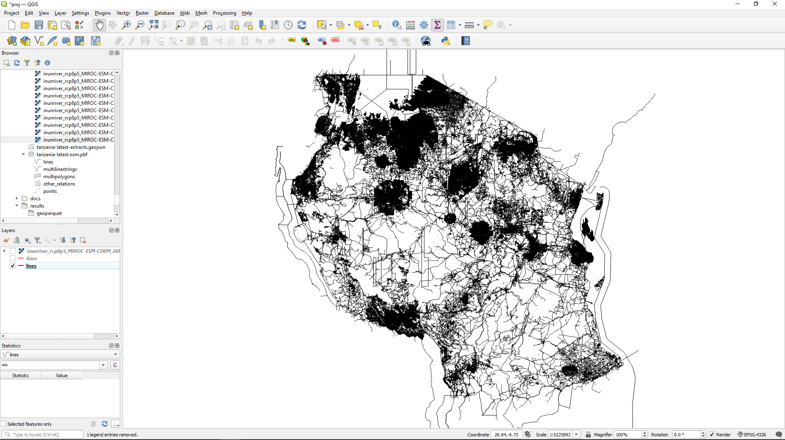

# Tanzania OpenStreetMap data

Now we have the programs we need, we can download the data we'll be using.
The infrastructure data will be obtained from the OpenStreetMap file for Tanzania.
To download, click [this direct link](https://download.geofabrik.de/africa/tanzania-latest.osm.pbf)
or choose 'tanzania-latest.osm.pbf' from the 
[OpenStreetMap website](https://download.geofabrik.de/africa/tanzania.html).

The tanzania-latest.osm.pbf file should be stored inside your open-gira directory as
`./data/tanzania-latest.osm.pbf`. You may have to create the `./data` directory yourself.
Once you've downloaded and saved the file, open it in QGIS to take a look at its structure. 
You'll see it contains several layers of information. 
There's an awful lot of information here, so you may find that any adjustment in the view 
results in a very long rendering time.
QGIS experts can shorten this by playing with filters, etc., but new users
may find it easier to wait it out and scan ahead in this guide while waiting.
The one we are most interested in is the _lines_ layer, which shows the roads.
If you open up the lines layer, you'll see a skeleton of Tanzania showing the road infrastructure.

