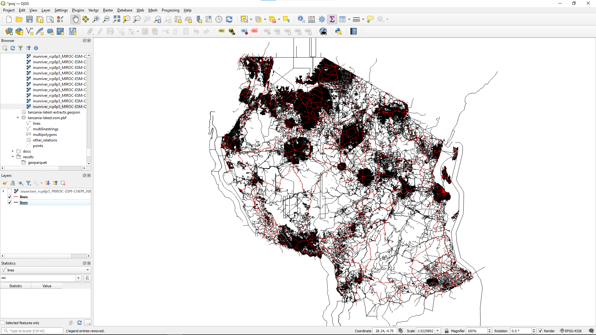
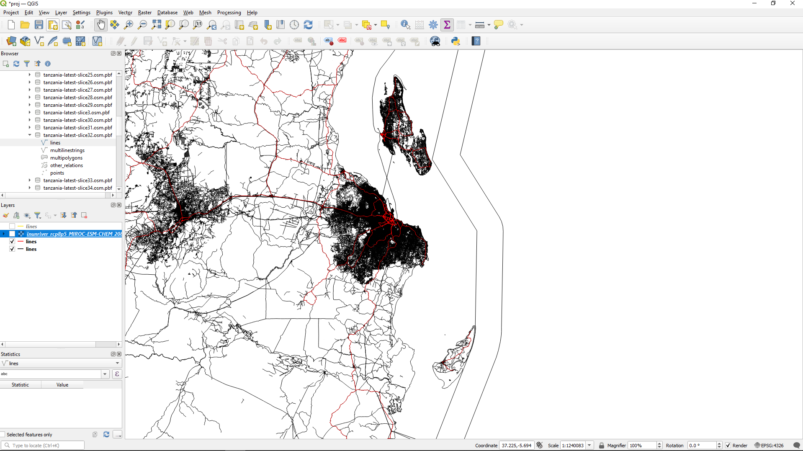

# 2. Filter each slice by infrastructure

The original data (`./data/tanzania-latest.osm.pbf`) contains lots and lots of information 
about points of interest, waterways, etc.
We strip it down to a version that contain only information about highways (and only highways that
match one of the types we specified in `./config/filters.txt`, or whichever other file we declared
as the `osmium_tags_filters_file` variable in `./config/config.yaml`).

This file is in `./results`, so let's open it up in QGIS.
Load `./results/tanzania-latest.highway-core.osm.pbf`, 
and notice that there are fewer roads than in the previous file.
We've coloured the roads in the new file in red.

If you zoom in a lot, you'll see there are many, many roads that are not included in this smaller file.
Here, we've zoomed in on the port area of Dar es Salaam.

