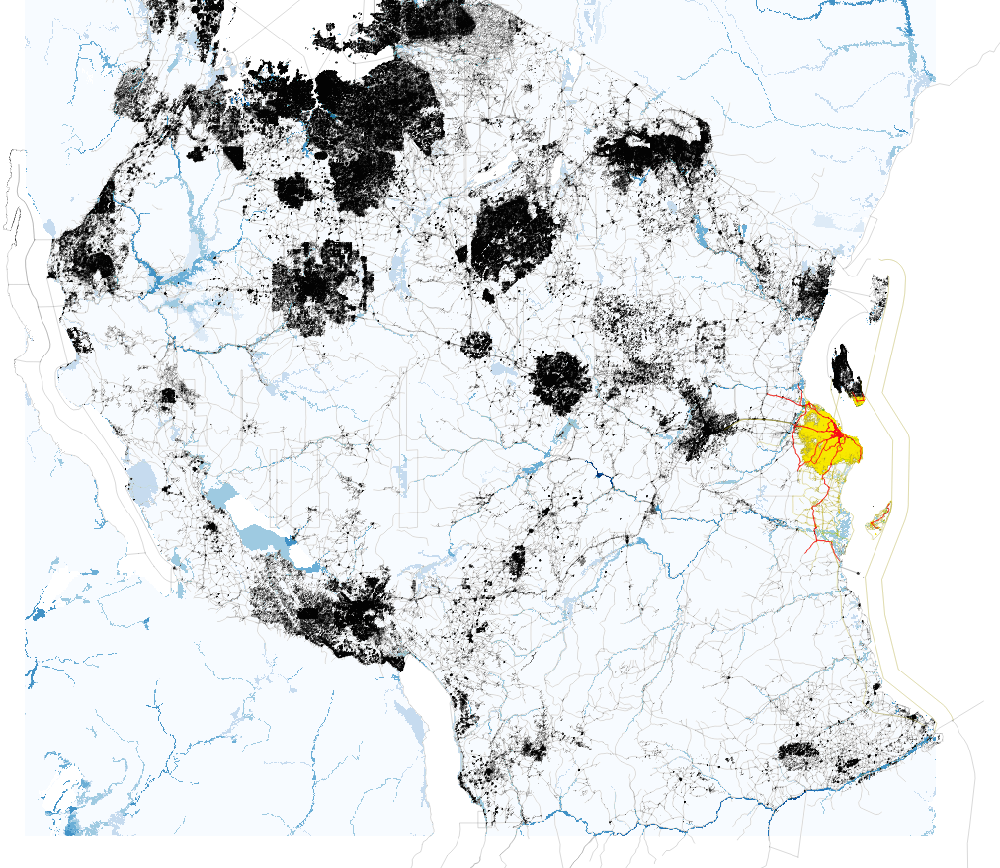
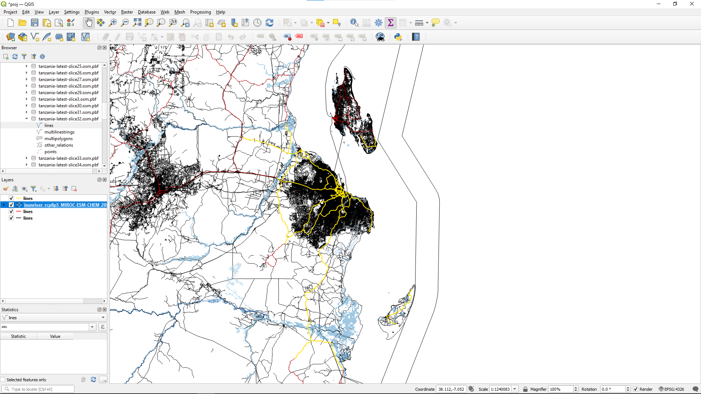

# Join data

The split data files are reunited to produce a .geoparquet file 
that contains infrastructure-hazard information for 
each combination of infrastructure and hazard datasets.
These files are placed directly in `./results/`.
Let's open `./results/tanzania-latest_filter-highway-core_hazard-aqueduct-coast.geoparquet` 
up in Python and have a look:

```python
# geopandas already imported
result_file = 'results/tanzania-latest_filter-highway-core_hazard-aqueduct-coast.geoparquet'
result = geopandas.read_parquet(result_file)
print(result)
```

We should see something similar to before (just with a lot bigger row and column counts).
It's so big that it might take a noticeable length of time to run that bit of code.
Let's take a look at just a couple of columns and order them by one of the flood depth columns
so we can check we have some flood depth data there:

```python
# pandas syntax for dataframe addressing, take all rows and columns 1, 2, 3, and the penultimate one
subset = result.iloc[:, [1, 2, 3, len(result.columns) - 2]]
tmp = subset.sort_values(subset.columns[-1], ascending=False)
print(tmp[:10])  # print just the first 10 rows
```

We should see an output something like:
```text
                                               geometry  ... inuncoast_historical_nosub_hist_rp0005_0
422   LINESTRING (39.64479 -5.36020, 39.64472 -5.360...  ...                                 2.837689
1107  LINESTRING (39.64458 -5.36021, 39.64207 -5.359...  ...                                 2.837689
27    LINESTRING (39.29476 -5.80913, 39.29473 -5.809...  ...                                 2.421950
893   LINESTRING (39.21142 -6.14412, 39.21137 -6.144...  ...                                 1.840523
88    LINESTRING (39.21787 -6.10305, 39.21790 -6.102...  ...                                 0.918276
887   LINESTRING (39.21787 -6.10305, 39.21781 -6.103...  ...                                 0.918276
277   LINESTRING (39.08641 -5.06488, 39.08621 -5.064...  ...                                 0.062613
999   LINESTRING (37.86131 -4.07896, 37.85298 -4.08253)  ...                                 0.000000
991   LINESTRING (37.90298 -4.10237, 37.90297 -4.102...  ...                                 0.000000
992   LINESTRING (37.90095 -4.10026, 37.90089 -4.100...  ...                                 0.000000

[10 rows x 4 columns]
```

That's what we're after: we can see that we have a range of values for the hazard scenario,
with nearly 3m of flooding in the worst-affected areas.
If we were to look at some of the longer return periods we would find the hazard data
gave much more widespread and much more extreme values.

We can use QGIS to inspect what these data look like, albeit one scenario at a time.
The data we're looking at in the column chosen above we can see by enabling the
roads lines and hazard raster in QGIS. 
In the example below I've chosen somewhat arbitrary colours for different flood depths.



Here's an example of the same zoomed in on Dar es Salaam.


