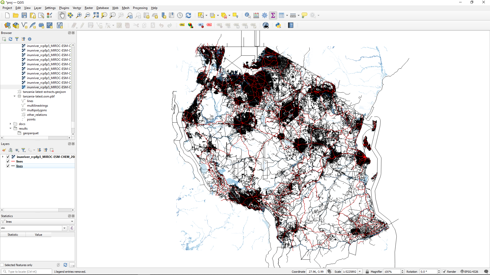

# Join data

Finally, the split data files are reunited to produce a .geoparquet file that contains infrastructure-hazard
information for the whole of the original .osm.pbf file.
This file is `./results/tanzania-latest_filter-highway-core_hazard-aqueduct-river.geoparquet`.
Let's open it up in Python and have a look:

```python
# geopandas already imported
result_file = 'results/tanzania-latest_filter-highway-core_hazard-aqueduct-river.geoparquet'
result = geopandas.read_parquet(result_file)
print(result)
```

We should see something similar to before (just with a lot bigger row and column counts).
It's so big that it might take a noticeable length of time to run that bit of code.
Let's take a look at just a couple of columns and order them by one of the flood depth columns
so we can check we have some flood depth data there:

```python
# pandas syntax for dataframe addressing, take all rows and columns 1, 2, 3, and the penultimate one
subset = result.iloc[:, [1, 2, 3, len(result.columns) - 2]]
tmp = subset.sort_values(subset.columns[-1], ascending=False)
print(tmp:10)  # print just the first 10 rows
```

We should see an output something like:
```text
                                               geometry  ... hazard_river__climate_rcp8p5__model_MIROC-ESM-CHEM__y_2080__rp_1000
1184  LINESTRING (38.49278 -11.41245, 38.49047 -11.4...  ...                                           9.807676                 
297   LINESTRING (38.49414 -11.41449, 38.49278 -11.4...  ...                                           9.807676                 
774   LINESTRING (36.49820 -7.47098, 36.49834 -7.470...  ...                                           9.144443                 
342   LINESTRING (38.48983 -11.40800, 38.48956 -11.4...  ...                                           7.027677                 
1185  LINESTRING (38.49047 -11.40897, 38.48983 -11.4...  ...                                           7.027677                 
773   LINESTRING (36.49621 -7.47144, 36.49820 -7.47098)  ...                                           5.884442                 
841   LINESTRING (37.37099 -11.67292, 37.37137 -11.6...  ...                                           5.094836                 
432   LINESTRING (30.64964 -1.06086, 30.64913 -1.062...  ...                                           4.543001                 
1169  LINESTRING (30.64819 -1.06578, 30.64815 -1.066...  ...                                           4.543001                 
1175  LINESTRING (30.67083 -1.05252, 30.67078 -1.052...  ...                                           4.543001                 

[10 rows x 4 columns]
```

That's what we're after: we can see that we have a range of values for the (rather extreme) hazard scenario,
with nearly 9m of flooding in the worst-affected areas!
It does have a return period of 1000 years, though, so perhaps that's not too surprising.

We can use QGIS to inspect what these data look like, albeit one scenario at a time.
The data we're looking at in the column chosen above we can see by enabling the
roads lines and hazard raster in QGIS. 
In the example below I've chosen somewhat arbitrary colours for different flood depths.



Here's an example of the same zoomed in on Dar es Salaam.


## Further analysis

Now you've worked through an example of the open-gira workflow, and you have an understanding of the relevant
file formats, how the process works, and how to inspect things as you go along, you're ready to use open-gira
for your own work.
Find an OSM datafile to work with, slice it up, and intersect some hazard data.
The resulting .geopandas data can be manipulated to answer particular questions, or further combined with
different spatial information or other open-gira outputs.
