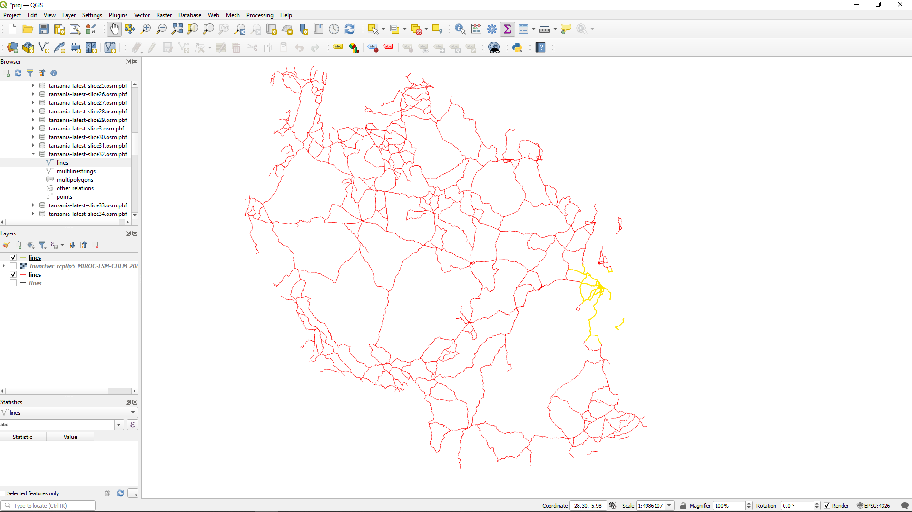

# Slice OSM dataset

The filtered dataset (`./results/tanzania-latest_filter-highway-core.osm.pbf`) is sliced into areas of equal size
according to the slices defined in (`./data/tanzania-latest-extracts.geojson`).
We'll find these in the `results/slices` directory.
As with the main .osm.pbf file, we can view this in QGIS. 

Open QGIS and load in the _lines_ for the filtered datafile, `./data/tanzania-latest_filter-highway-core.osm.pbf`.
When that's loaded, pull up one of the slices we created.
Several of the slices will not have road information, so we won't get any feedback in QGIS that
we've got any information in there at all. 
So we'll pick one that _does_ have information, slice 32 (Dar es Salaam):
`./results/slices/tanzania-latest_filter-highway-core_slice-32.osm.pbf`.
Load up the _lines_ in that and you should see that it doubles up the road lines around Dar es Salaam
(Eastern coast of Tanzania).
In the image below, we have recoloured the lines so that the lines for slice 32 are in yellow.

