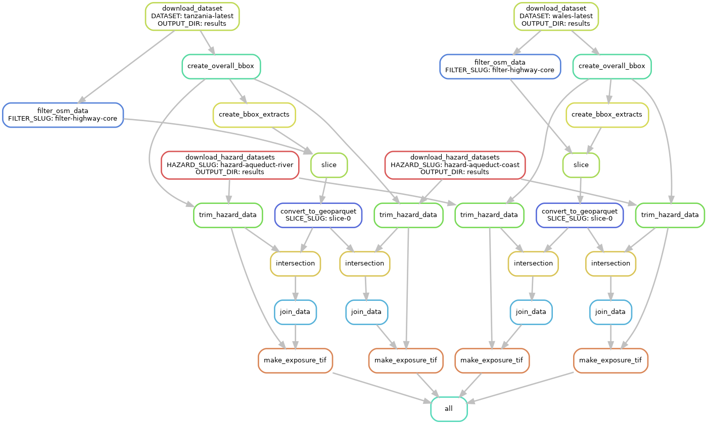
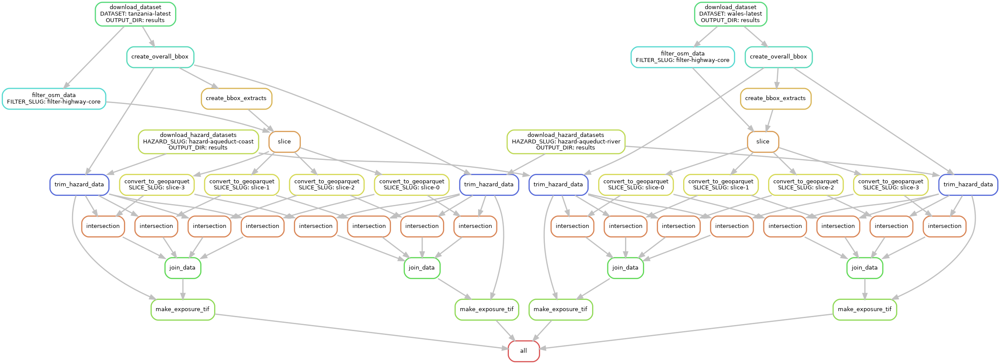

# Advanced view of the workflow

The simple view of the workflow covered in the [main workflow section](workflow.md)
is relatively easy to understand, but does a poor job of explaining where Snakemake
excels.
Below, you will find steadily more complex views of the workflow, becoming increasingly
realistic with each iteration.
Click on any image to view the full-size version.

## Simple view

As a reminder, here's our simple workflow view again:
[](../img/DAG-simple.png)

## Multiple slices

Here is a more realistic (but slightly harder to follow) version of the previous
DAG with `slice_count: 4`.
In actual practice we'll often be using much higher `slice_count` values.
In this tutorial, for instance, we use `slice_count: 36`.
[](../img/DAG-simple-slices.png)

## Multiple hazard and infrastructure datasets

Another complexity is that we can specify multiple datasets to use --
we can feed in different infrastructure maps, and different hazard information.
Each infrastructure map is combined with each hazard dataset to produce a final output.
The `config.yaml` file for this diagram includes:
```yaml
hazard_datasets:
  aqueduct-coast: 'https://raw.githubusercontent.com/mjaquiery/aqueduct/main/tiffs.txt'
  aqueduct-river: 'https://raw.githubusercontent.com/mjaquiery/aqueduct/main/rivers.txt'
  
infrastructure_datasets:
  tanzania-latest: 'https://download.geofabrik.de/africa/tanzania-latest.osm.pbf'
  wales-latest: 'https://download.geofabrik.de/europe/great-britain/wales-latest.osm.pbf'

slice_count: 1
```
[](../img/DAG-multiple.png)

## Full workflow

Finally, we'll set the `slice_count` from the above config to `4` again, and glimpse the
full workflow. Remember, though, we could have many more datasets and use many more slices.
[](../img/DAG-multiple-slices.png)
