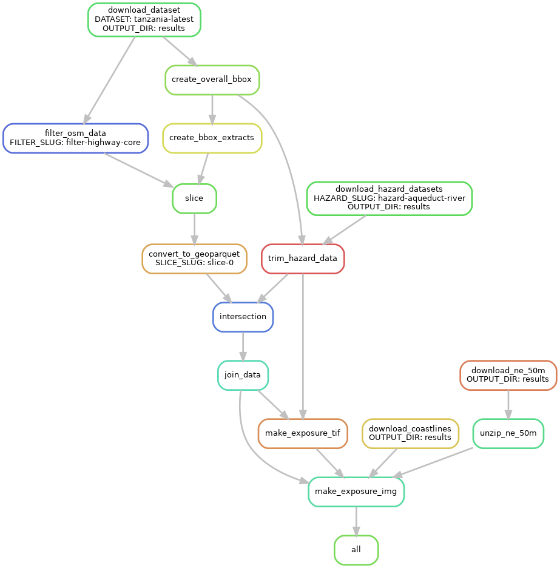

# Exploring output

The program will have created a great many files in subdirectories of `./results`.
Each of these will be the result of one of the steps in the workflow process:
1. Filter the OpenStreetMap data to focus on major infrastructure components
2. Determine the bounding box from the OpenStreetMap data
3. Calculate a grid of bounding boxes for slicing the OpenStreetMap data
4. Slice the OpenStreetMap data into smaller sections
5. Convert OpenStreetMap data to .geoparquet format
6. Add hazard information to infrastructure geoparquet
7. Join slices together to produce overall geoparquet file

These steps, along with the output produced at each stage, 
are described in the subsections of this chapter.

These steps are summarised in the digital acyclic graph for `slice_count: 1`,
for just the `tanzania-latest` infrastructure and `aqueduct-coast` hazard data:

