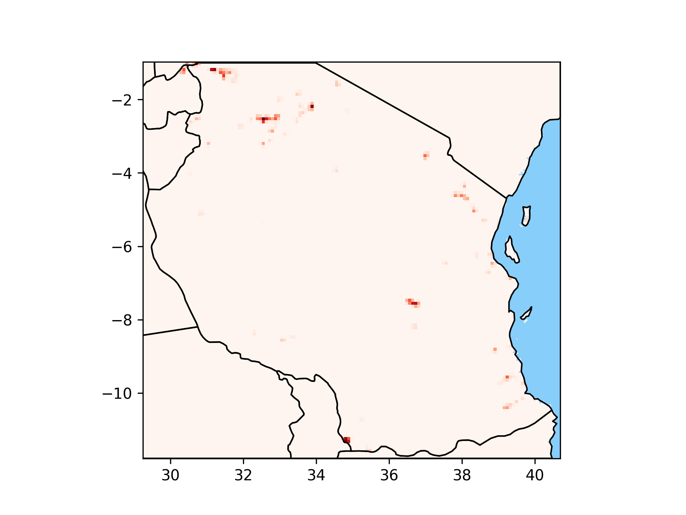

# Exposure images

In the image production step, the exposure rasters are combined with ocean and administrative boundary information
to produce images that place the raster information in a useful geographic context.
The rules governing how the different layers are plotted can be specified in the [config file](../configuration.md).

The final image will be saved as
`./results/exposure/tanzania-latest_filter-highway-core/hazard-aqueduct-river/img/exposure_inunriver_rcp4p5_MIROC-ESM-CHEM_2030_rp00100.png`

For river data in Tanzania, the image will look like:

