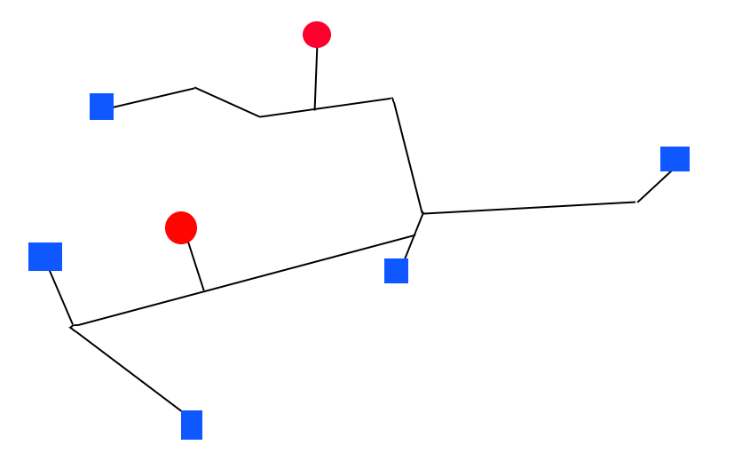

# Damage calculations

This script uses the [wind parameter data](windspeed.md) to determine the damage parameters
for an individual storm.

The process consists of the following:
1. Load the [wind parameter data](windspeed.md) from the storm
2. For each unit, determine if the damage criteria is met (for the lower, central and upper damage thresholds)
3. For these damaged units, mark any infrastructure within these units as damaged
4. Calculate the damage parameters when infrastructure fails
5. Save the damaged units and associated infrastructure components and targets to gpkg files
6. Add basic statistics for each storm
7. Write the storm track to the gpkg file

A few notes should be made on this process.

#### Step 2
The (central) damage criteria is assumed to be a minimum wind speed of a category 2 hurricane. This corresponds to
43 m/s. The lower threshold is set to 39 m/s and upper to 47 m/s.


#### Step 4
In order to assign each target a GDP loss value, we first create power network components. See an example below in which
red circles are power plants and blue squares are the targets.




Each component can be treated as its own
entity and does not interact with other components. That means that the power plants in a selected component provide power to the
targets in this selected component. To achieve this, we assume that the total power in a component is given by the sum of the
power from all power plants in that component. We assume the power is distributed proportionally to the GDP of the target
(see [here](../process/targets.md) for details on target GDP allocation):

```shell
(nominal target power) = (total component power) * (target GDP) / (total component target GDP)
```

Say now that a storm hits and it is found (using the damage criteria) that one network component fails. This marked by
target symbol. The component may not be split into subcomponents:


Each subcomponent can now be examined where now

```shell
(post storm target power) = (total subcomponent power) * (target GDP) / (total component target GDP)
```
The fraction `(target GDP) / (total component target GDP) ` remains unchanged as it is assumed that the ratio does
not change. Each target then has a GDP loss described by the following (using the proportionality):

````shell
target GDP loss = [((nominal target power) - (post storm target power))/ (nominal target power)] * (target GDP)
````

(n.b. the term inside the brackets corresponds to 1-f for the explanation in step 6)

Further examples include two damaged components:


Three damaged components:

Here, there is a subcomponent which is ignored as it does not contain power plants or targets.

Network loops with one damaged component:

Note that the very inner loop is ignored as it is a 'network' with one node.

Two damaged components:


One can see that the above analysis can be performed regardless.


#### Step 6
For this step and further steps, we must first define the 'f value' for each target:
```text
f = (nominal power)/(power after storm)
```

When `f=0` the target has no power after the storm and `f=1` means the target is unaffected by the storm.
When `0<=f<1` then the target is listed as affected by the storm. The effective population affected is the fraction of
the population which has an effective power of 0 i.e. `pop_eff = (1-f)*pop` summed for each target. This means that if
a target has a population of 100 people and `f=0.2`, `pop_eff = 80`. We can now define the damage parameter statistics that are considered:
- GDP losses: indirect economic losses
- targets affected: number of targets which have the property `0<=f<1`
- targets `1>f>0_75`
- targets `0_75>=f>0_5`
- targets `0_5>=f>0_25`
- targets `0_25>=f>0`
- targets with no power (`f=0`)
- population affected: The population which is contained in affected targets (`0<=f<1`)
- population with no power (`f=0`): The population which is contained in targets with no power after the storm (`f=0`)
- effective population affected: The population affected which is proportional to the f value of their respective targets
- affected countries: All countries which have at least one target that is affected (`0<=f<1`)

### Storm Data
The data for each storm (including damage parameters) is then found in `results/power_intersection/storm_data/individual_storms/{region}/{sample}/{storm_identifier` should this be wished to be examined.


### Rerunning damage calculations
Should the damage calculations need to be rerun (due to e.g. damage tolerance adjustment) then you must delete (or rename) `results/power_output/statistics/{region}/{sample}/combined_storm_statistics_{region}_{sample}.csv` for the corresponding region(s) and sample(s)
AND delete (or rename) `results/power_intersection/storm_data/individual_storms`. Use `-n` at the end of the snakemake command to check this has worked with a dry run first before running the snakemake workflow.
