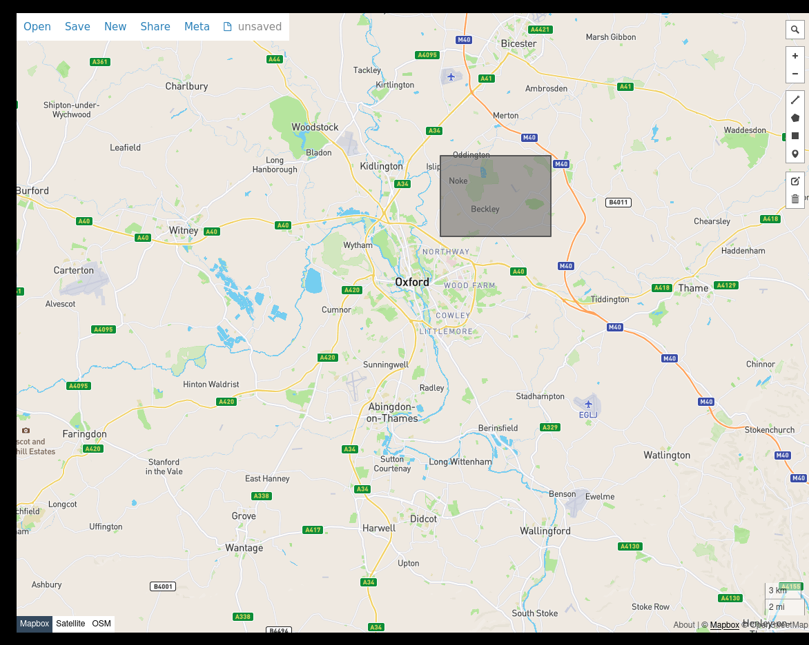
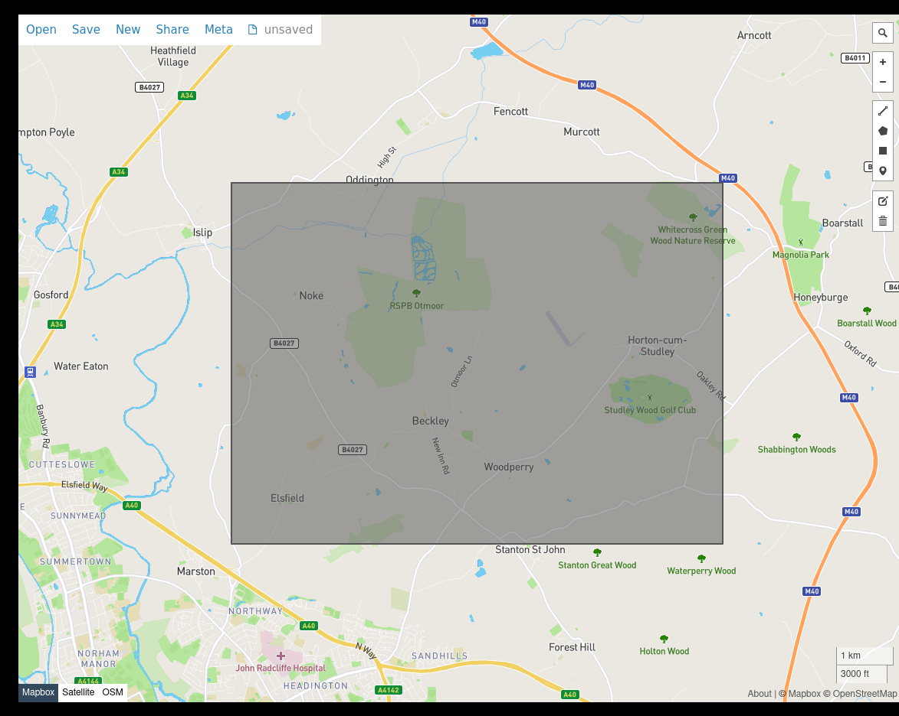

# Testing

The pipeline is tested on a small sample of OpenStreetMap data
representing a region northeast of Oxford, UK. For each rule used in
`workflow/Snakefile` there is a unit test ensuring that the expected
outputs are generated, given inputs based on the northeast Oxford
dataset. Unit tests are automatically generated unsing `snakemake
--generate-unit-tests`, see [Automatically generating unit tests](https://snakemake.readthedocs.io/en/stable/snakefiles/testing.html) on the Snakemake docs.

Test dataset area          | Test dataset area (zoomed)
:-------------------------:|:-------------------------:
  |  

## Generating the test dataset

The test dataset can be generated by extracting data from a larger
region, typically [`oxfordshire-latest`](http://download.geofabrik.de/europe/great-britain/england/oxfordshire.html).

First, we write a config file for `osmium extract`, say
`northeast-oxford.json`, that defines the region to extract and the
target file.

```json
{
    "directory": "./results/slices",
    "extracts": [
        {
            "bbox": [
                -1.23,
                51.78,
                -1.12,
                51.83
            ],
            "output": "northeast-oxford.highway-core.osm.pbf"
        }
    ]
}

```

Then we, download `oxfordshire-latest` and extract the region into `data/northeast-oxford.osm.pbf`
```shell
wget http://download.geofabrik.de/europe/great-britain/england/oxfordshire-latest.osm.pbf
osmium extract --config northeast-oxford.json
```

## Auto-generating the tests

Running `snakemake` with the `--generate-unit-tests` options
automatically create unit tests for each rule in the workflow
file. Input data and expected outputs are copied into a specific
directory under `tests/units`. This means that, before generating the
tests, the pipeline must have been successfully ran at leat once, in
order for the expected outputs to be there.

```shell
# Run the pipeline once for the test dataset
snakemake --cores 1 --configfile tests/config.yaml
# Generate unit tests
snakemake --cores 1 --configfile tests/config.yaml --generate-unit-tests
```

The second command creates a directory tree under `.tests` with one
test per rule, input data and expected output data. However, generated
tests are not ready for use right-away.

## Fixing the tests

As of Dec 2015, tests generated by Snakemake contain a syntax error
when specifying a config file (see
[#843](https://github.com/snakemake/snakemake/issues/843) on the
Snakemake issue tracker).

We therefore modify the tests files `tests/unit/test_<rule name>.py` to
copy the test configuration file under the `config` directory inside
the temporary test directory. As such it will be picked up by
Snakemake as the default configuration file.

We search those files for where `sp.check_output` specifies the config file
and replace the syntax error bit with a nice string specifying the location
of our config file: `"test/config.yaml"`.

We also need to edit the extracts file in `slice/dta/data/northeast-oxford-extracts.geojson`
to remove all slices apart from slice0.

